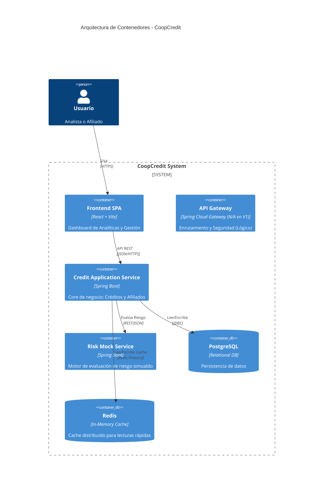

```mermaid
C4Context
    title Arquitectura de Contenedores - CoopCredit

    Person(user, "Usuario", "Analista o Afiliado")
    System_Boundary(system, "CoopCredit System") {
        Container(frontend, "Frontend SPA", "React + Vite", "Dashboard de Analíticas y Gestión")
        Container(gateway, "API Gateway", "Spring Cloud Gateway (N/A en V1)", "Enrutamiento y Seguridad (Lógico)")
        
        Container(credit_app, "Credit Application Service", "Spring Boot", "Core de negocio: Créditos y Afiliados")
        Container(risk_mock, "Risk Mock Service", "Spring Boot", "Motor de evaluación de riesgo simualdo")
        
        ContainerDb(db, "PostgreSQL", "Relational DB", "Persistencia de datos")
        ContainerDb(redis, "Redis", "In-Memory Cache", "Cache distribuido para lecturas rápidas")
    }

    Rel(user, frontend, "Usa", "HTTPS")
    Rel(frontend, credit_app, "API REST", "JSON/HTTPS")
    Rel(credit_app, db, "Lee/Escribe", "JDBC")
    Rel(credit_app, redis, "Lee/Escribe Cache", "Redis Protocol")
    Rel(credit_app, risk_mock, "Evalúa Riesgo", "REST/JSON")
```
