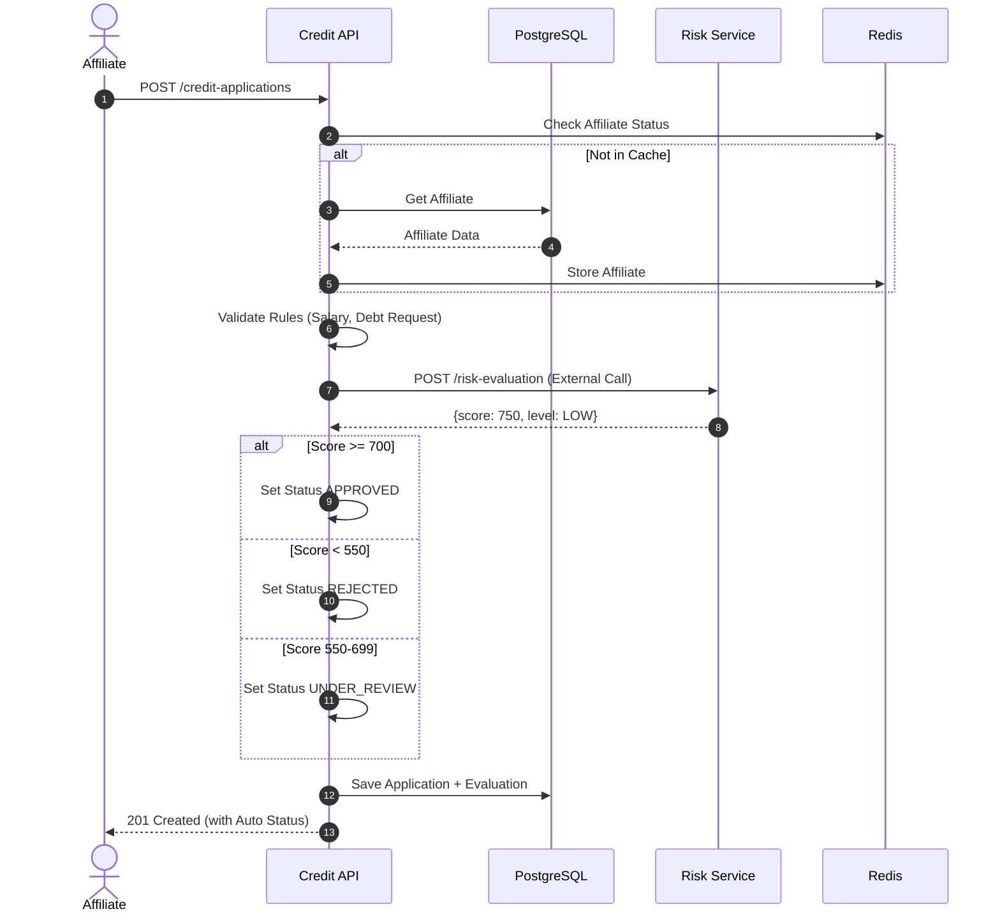

```mermaid
sequenceDiagram
    autonumber
    actor Affiliate
    participant API as Credit API
    participant DB as PostgreSQL
    participant Risk as Risk Service
    participant Cache as Redis

    Affiliate->>API: POST /credit-applications
    API->>Cache: Check Affiliate Status
    alt Not in Cache
        API->>DB: Get Affiliate
        DB-->>API: Affiliate Data
        API->>Cache: Store Affiliate
    end
    
    API->>API: Validate Rules (Salary, Debt Request)
    
    API->>Risk: POST /risk-evaluation (External Call)
    Risk-->>API: {score: 750, level: LOW}
    
    alt Score >= 700
        API->>API: Set Status APPROVED
    else Score < 550
        API->>API: Set Status REJECTED
    else Score 550-699
        API->>API: Set Status UNDER_REVIEW
    end
    
    API->>DB: Save Application + Evaluation
    API-->>Affiliate: 201 Created (with Auto Status)
```
