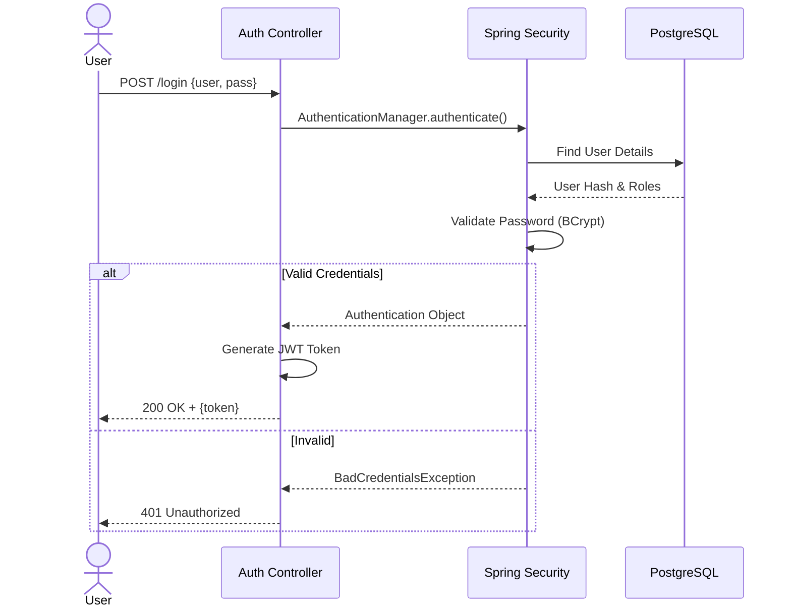

```mermaid
sequenceDiagram
    actor User
    participant Auth as Auth Controller
    participant Security as Spring Security
    participant DB as PostgreSQL
    
    User->>Auth: POST /login {user, pass}
    Auth->>Security: AuthenticationManager.authenticate()
    Security->>DB: Find User Details
    DB-->>Security: User Hash & Roles
    Security->>Security: Validate Password (BCrypt)
    
    alt Valid Credentials
        Security-->>Auth: Authentication Object
        Auth->>Auth: Generate JWT Token
        Auth-->>User: 200 OK + {token}
    else Invalid
        Security-->>Auth: BadCredentialsException
        Auth-->>User: 401 Unauthorized
    end
```
