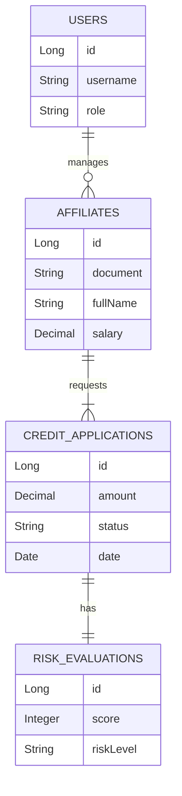

```mermaid
erDiagram
    USERS ||--o{ AFFILIATES : manages
    AFFILIATES ||--|{ CREDIT_APPLICATIONS : requests
    CREDIT_APPLICATIONS ||--|| RISK_EVALUATIONS : has

    USERS {
        Long id
        String username
        String role
    }
    AFFILIATES {
        Long id
        String document
        String fullName
        Decimal salary
    }
    CREDIT_APPLICATIONS {
        Long id
        Decimal amount
        String status
        Date date
    }
    RISK_EVALUATIONS {
        Long id
        Integer score
        String riskLevel
    }
```
