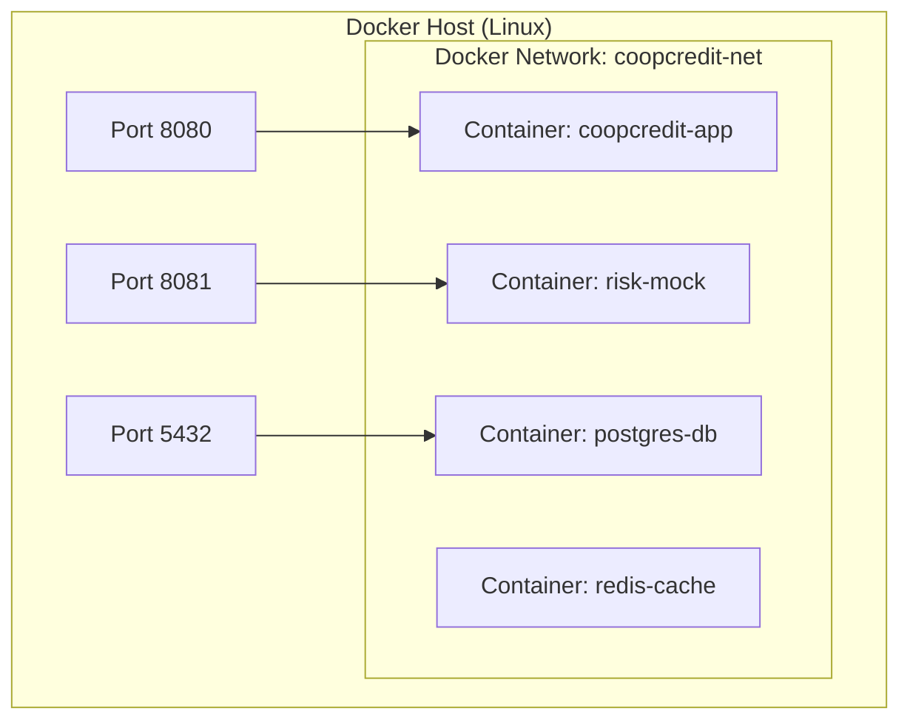

```mermaid
graph TB
    subgraph "Docker Host (Linux)"
        subgraph "Docker Network: coopcredit-net"
            Container1[Container: coopcredit-app]
            Container2[Container: risk-mock]
            Container3[Container: postgres-db]
            Container4[Container: redis-cache]
        end
        Port1[Port 8080] --> Container1
        Port2[Port 8081] --> Container2
        Port3[Port 5432] --> Container3
    end
```
