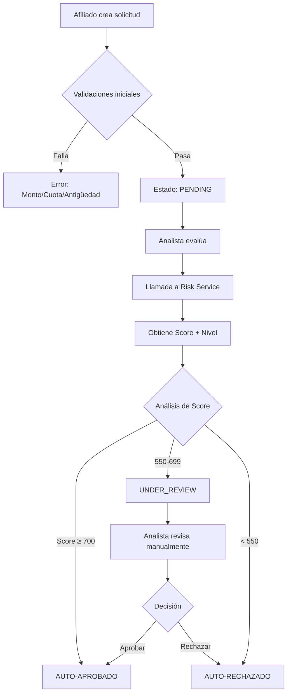

# Flujo de Evaluación de Crédito

```mermaid
graph TD
    A[Afiliado crea solicitud] --> B{Validaciones iniciales}
    B -->|Falla| C[Error: Monto/Cuota/Antigüedad]
    B -->|Pasa| D[Estado: PENDING]
    D --> E[Analista evalúa]
    E --> F[Llamada a Risk Service]
    F --> G[Obtiene Score + Nivel]
    G --> H{Análisis de Score}
    H -->|Score ≥ 700| I[AUTO-APROBADO]
    H -->|550-699| J[UNDER_REVIEW]
    H -->|< 550| K[AUTO-RECHAZADO]
    J --> L[Analista revisa manualmente]
    L --> M{Decisión}
    M -->|Aprobar| I
    M -->|Rechazar| K
```
